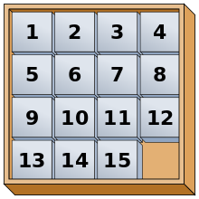
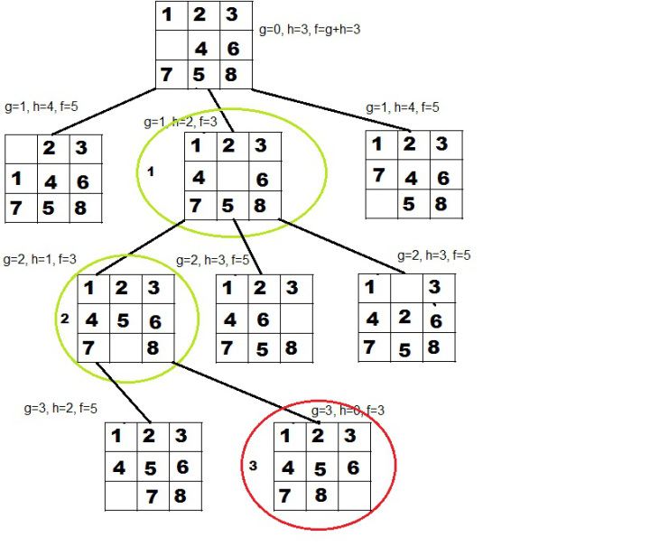

# Sliding blocks (N-Puzzle)

## What is N-Puzzle?
N-Puzzle or sliding puzzle is a popular puzzle that consists of N tiles where N can be 8, 15, 24 and so on. The puzzle is divided into √(N+1) rows and √(N+1) columns eg. 15-Puzzle will have 4 rows and 4 columns, an 8-Puzzle will have 3 rows and 3 columns and so on. The puzzle consists of one empty space where the tiles can be moved and thus the puzzle is solved when a particular goal pattern is formed like the following is one of the variant goal pattern.

## Task
Use [A star](https://en.wikipedia.org/wiki/A*_search_algorithm) algorithm with [Manhattan distance](http://theory.stanford.edu/~amitp/GameProgramming/Heuristics.html#manhattan-distance) heuristic to solve the puzzle

For the task I have used [Wintellect Power Collections](https://archive.codeplex.com/?p=PowerCollections)'s `OrderedBag` as a priority queue

## Explanation
Each node represents a graph node of a state and all of its children represent the next possible moves. 
The heuristic function returns the number of moves every piece is from its solution place. 
The nodes in the queue are ordered on their `f = g + h`, where `h` is the heuristic and `g` is the level of the node.

Get the next node from the queue and check if it is a solution. 
If it isn't, put all of its children in the queue.

Rinse and repeat until we have a solution

